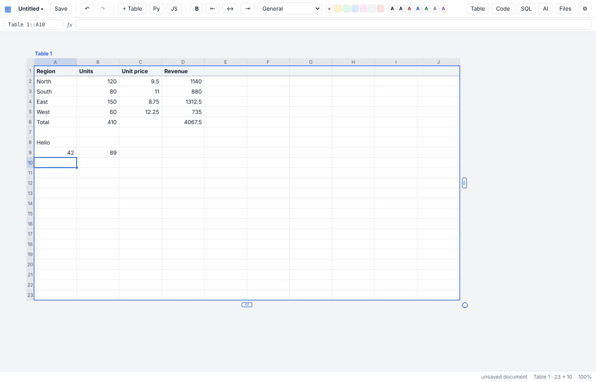
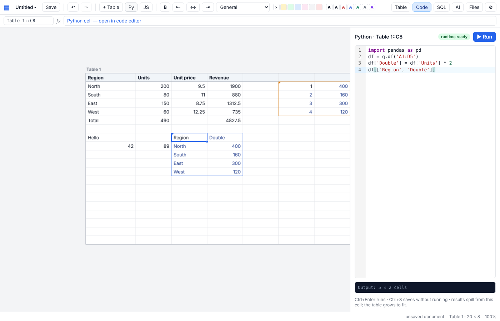
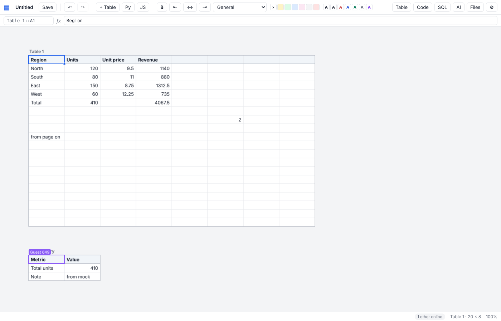

# Gridwright

An AI-native spreadsheet with free-floating, resizable tables on an infinite canvas — built on the same stack as Quadratic (Rust → WebAssembly engine, TypeScript/React client rendering on a WebGL canvas, Python in the browser via Pyodide, JavaScript and SQL cells, an AI assistant and live multiplayer), with Apple Numbers-style tables that you drag and resize from their handles, and an audit trail that records every change. MIT-licensed, self-hosted, builds natively on arm64.



## Features

| Area | What works |
|---|---|
| **Tables (Numbers-style)** | Several named tables per document on a pannable/zoomable canvas. Drag the title to move; drag the **corner circle** to add/remove rows *and* columns at once, the **right handle** for columns, the **bottom handle** for rows; drag column/row edges to resize; reference tabs appear when a table is selected. Header row; insert/delete rows and columns with formula references rewritten; renaming a table rewrites every formula that mentions it. |
| **Formulas** | A1 references, ranges, whole columns/rows, cross-table references (`Sales::B2`, `'Table 1'::A1:C9`), **structured references** by header name (`Orders[Amount]`, `[@Unit price]`), **named ranges**, **270 functions** (`LET`, `OFFSET`, `INDIRECT`, `XMATCH`, `TEXTSPLIT`, `REGEXEXTRACT`, `PERCENTILE`, `CORREL`, `NORM.INV`, `HSTACK`/`VSTACK`/`TAKE`/`DROP`/`WRAPROWS`, …), dependency-driven recalculation with cycle detection, relative/absolute references that shift on copy/paste and fill-down, live preview while typing. |
| **Dynamic arrays** | A formula whose result is an array **spills** into the cells below/right (`=A1:A9*2`, `=FILTER(…)`, `=SORT(…)`, `=SORTBY(…)`, `=UNIQUE(…)`, `=SEQUENCE(…)`, `=TRANSPOSE(…)`); scalar functions lift over arrays (`=ROUND(A1:A9/3, 1)`), blocked spills show `#SPILL!` and recover when the blocker goes. |
| **Finance & dates** | NPV, IRR, MIRR, XNPV, XIRR, PMT, IPMT, PPMT, CUMIPMT, CUMPRINC, ISPMT, PV, FV, FVSCHEDULE, NPER, RATE, RRI, PDURATION, SLN, SYD, DB, DDB, EFFECT, NOMINAL; DATEDIF, YEARFRAC, DAYS360, NETWORKDAYS(.INTL), WORKDAY(.INTL), WEEKNUM, ISOWEEKNUM, EDATE, EOMONTH, TIME/TIMEVALUE/HOUR/MINUTE/SECOND. Dates typed as text (`2026-10-08`, `08/10/2026`, `8 Oct 2026 14:30`) become serial numbers with a matching format; `12%`, `€ 1.000,00`, `1,500 Kz` keep their formats. Patterns: `#,##0.00`, `#.##0,00` (decimal comma), `€#,##0.00`, `#,##0.00 "Kz"`, `yyyy-mm-dd hh:mm`, `d mmm yyyy`. |
| **Filters** | Header dropdowns (values or conditions) hide rows; `SUBTOTAL(101…111)` ignores hidden rows; sort A→Z/Z→A from the same menu; Ctrl+Shift+L. |
| **Conditional formatting** | Cell-value, text, colour scale, top/bottom N, duplicates, blanks, formula rules per table (Rules panel). |
| **Data validation** | List (literal or a range such as `Lists::A2:A20`, with a dropdown in the editor), number, whole number, date, text length; strict rules refuse the entry, others mark it with a red corner. |
| **Pivot tables** | A table can be the pivot of another: row fields, an optional column field, sum/count/average/min/max/distinct values, totals — recomputed by the engine whenever the source changes; formulas can reference the pivot. |
| **Python cells** | `q.cells("A1:B5")`, `q.df("Table 2::A1:D20")` (pandas), `q.table()`; the last expression spills; matplotlib figures render on the canvas; cells re-run when the cells they read change. Two runtimes, chosen per cell: **on the server** (the default when the host has Python) — real CPython with pandas/numpy/matplotlib, roughly 5–10× faster than the browser for pandas work, nothing to download on a phone; or **in the browser** — Pyodide (WebAssembly) in a web worker, packages auto-loaded from imports, optionally served by the server (`--pyodide`) so nothing is fetched from the internet. |
| **Server-side Python: sandbox, budgets, GPU** | Each run is a fresh process forked from a warm host (pandas already imported: ~10 ms overhead) inside **bubblewrap** (own mount/PID/network namespaces; the data directory, home directories and secrets are invisible; `/tmp` is a throwaway) with CPU, memory, file-size and wall-clock limits. **Fail-closed**: if bubblewrap cannot start, server-side Python stays *off* and `/api/python` says why — weaker isolation (`unshare`, `none`) is an explicit choice, never a silent downgrade. **Budgets**: a per-run memory cap that also applies when a GPU request falls back to the CPU, a bounded queue — runs beyond it are refused at once (HTTP 429) rather than piling up — and a thread cap per run. **Permissions**: running code on the host and taking GPU time are separate from editing (`GRIDWRIGHT_PYTHON_USERS`, `GRIDWRIGHT_GPU_USERS`); viewers never execute. The sandbox level is shown in the Code panel and written into every run record. **GPU**: tick *GPU* on a cell to run its pandas code through RAPIDS `cudf.pandas` when the host has it (verified on a DGX Spark with `cudf-cu13`); without cuDF the cell runs on the CPU and the record says so. Worth it above a few million rows, not for month-end tables. |
| **JavaScript cells** | Isolated worker, `async` allowed, `return` a value / list / 2-D array / array of objects. |
| **SQL** | PostgreSQL, MySQL/MariaDB and **SQL Server** (Cegid Primavera, Azure SQL) connections, credentials encrypted at rest. **SQL cells** run a query from a cell: `{{A1}}` / `{{Orders::B2}}` bind cell values as parameters (a range becomes a list for `IN (…)`), the result spills, the cell re-runs when its parameters change, and can refresh on a schedule (30 s … 1 h). |
| **SQL policy (server-enforced)** | Every query — from the SQL panel, a SQL cell, the assistant's tools or an MCP agent — goes through one policy point on the server. Connections are **read-only by default**: a single SELECT, no stacked statements, no `pg_sleep`/`LOAD_FILE`/`xp_*`, *and* the session itself is opened read-only (`BEGIN READ ONLY`; `SET SESSION TRANSACTION READ ONLY` + `START TRANSACTION READ ONLY` on MySQL/MariaDB) so a write hidden in a SELECT is refused by the database. The safeguards are **required, not best-effort**: if the database refuses the read-only mode or the statement timeout, the query is refused rather than run unguarded. Per connection: a **row limit** (streamed and cut on the server, reported as *truncated*), a **statement timeout** (cancelled database-side), and an optional **allow-list of logins** — other people do not even see the connection. Viewers cannot query. |
| **Charts (exhibits)** | Charts are objects on the canvas, drawn by the WebGL renderer and exported as SVG/PNG from the same layout. Column, horizontal bar, line, area, stacked and waterfall; an uppercase *EXHIBIT N — TOPIC* tag, an action title that states the takeaway, a grey subtitle with dataset and units, direct series labels (no legend), one highlighted observation in coral, a dashed benchmark line with an inline label, three stat cards and a source footnote. `+ Chart` builds one from the selection (header row → series names); drag to move, corner handle to resize, double-click to edit. The assistant can add charts too (`add_chart`). |
| **Review: sign-offs** | Select a range → *Sign off*: who, when, a note and a fingerprint of the values are recorded as an operation (so it is in the audit log). The badge turns amber the moment any value inside changes; a locked range refuses manual edits until unlocked. Share a document at *sign off* level to let a reviewer attest without editing: a sign-off share **cannot replace the document** (whole-document saves need *edit*); it asks the server to checkpoint, and the server builds that checkpoint from its own log. |
| **Review: execution evidence** | Every run of a Python, JavaScript or SQL cell is recorded in the audit log with the hash of its code, the hash of the values it read, the runtime and package versions (CPython version, pandas/numpy/cuDF versions and the sandbox level for server runs; Pyodide and its loaded packages; the JS engine; the database kind) and the hash of its output. Server-side runs are **attested by the server**: it computes the hashes and writes the record itself, so a browser cannot claim a result it did not get. The Review panel compares the record with what is on screen — *matches recorded run*, *inputs changed*, *code changed*, **output differs from recorded run** (a forged or edited result), *failed*, *not run* — and keeps hashes and runtime details under *Evidence*; the CSV export carries the records as `code_run` rows. |
| **Review: checks & trace** | `=CHECK(condition, "label")` cells are collected in the Review panel (passing / failing). *Trace* shows precedents (navy) and dependents (coral) of the active cell on the canvas; Ctrl+[ / Ctrl+] walk through them. |
| **Finance primitives** | `FX(amount, "USD", "AOA", [date])` and `FXRATE()` against a table named **FX** (Date \| From \| To \| Rate: latest rate on or before the date, inverse and triangulated rates); `RECONCILE(rangeA, rangeB, [tolerance])` spills Key \| A \| B \| Difference \| Status (Matched / Only in A / Only in B / Difference); `AGEING(dates, amounts, [as_of], [edges])` spills Bucket \| Count \| Amount \| Share; `AGE_BUCKET(date)` labels a row. Templates: accounts payable ageing, bank reconciliation, treasury position (with a Primavera SQL placeholder). |
| **Reference workbooks** | Three finance models with fixed data and independently computed results, shipped as templates and run in CI: **landed cost by VIN** (FOB in USD/EUR → CIF → duty → kwanza, freight and insurance allocated per shipment with the rounding absorbed exactly), **bank reconciliation** (ledger vs statement, a reversal pair, an in-transit receipt, fee and interest, a leading-zero cheque number matched across text and number), **13-week cash forecast** (collection-rate scenario, leap day, minimum-cash check). Each contains deliberate defects (a duplicate VIN, a duplicate statement posting) that its checks must report — so detection is part of the reference, not only the totals. |
| **MCP server & proposals** | `POST /mcp` is a Model Context Protocol server (streamable HTTP, stateless) with sixteen typed tools: `list_documents`, `read_document`, `read_table`, `read_range`, `evaluate` (a formula against the live document, nothing written), `run_checks`, `read_history`, `list_connections`, `run_sql` (same policy as above), `propose_edit`, `list_proposals`, and the companion's `read_context`, `read_graph`, `remember`, `propose_watch`, `list_attention`. Agents never write directly: `propose_edit` validates the actions on a copy of the document **as the editors currently see it** (latest checkpoint + every logged operation) and files a **proposal** whose preview lists the edits *and their consequences* — every cell whose value moves although its formula does not. The Review panel leads with what awaits approval; a person applies or rejects each proposal, with a note. **One commit path**: the server applies the decision — it re-validates the actions at the revision the person reviewed, refuses a decision made against an outdated preview (409, with a fresh preview attached), applies the same decision at most once (idempotent command ids), and writes the operations and the decision to the log together, as origin *agent*. The same tools respect document sharing and identity. |
| **AI assistant** | Any OpenAI-compatible chat endpoint (vLLM, Ollama, llama.cpp, OpenRouter, OpenAI, Anthropic compatibility). Every proposal is shown as a **before → after diff**; nothing is written until you apply it, and applied changes are logged with origin *AI*. With tools on, the model can call read-only server tools — `run_sql` (SELECT only, ≤200 rows), `list_tables`, `describe_table`, `read_history` — and every call and result is shown in the chat. Endpoints without function calling fall back automatically. |
| **Audit trail** | The server sequences every change into a per-document log (who, when, from a person / the AI / a code cell / an import), with checkpoints at each save (compacted: all from the last day, daily for 30 days, weekly after). The History panel lists changes, filters them per cell, restores or downloads any earlier version, **compares two versions** cell by cell, and exports the trail as **CSV**. |
| **Multiplayer** | Server-ordered operations: concurrent edits converge on every client. In-flight cell edits are transformed past remote row/column inserts and deletes (operational transform), undo/redo travels as restore operations instead of document snapshots, remote changes never enter your own undo stack, structural conflicts resync from the log; presence cursors with names. |
| **Identity, roles & sharing** | Behind `tailscale serve`, the server trusts Tailscale's identity headers: names in presence and history, `GRIDWRIGHT_ADMINS` (connections, AI settings, backups) and `GRIDWRIGHT_READONLY` (viewers). Per document: an owner, *everyone can edit / view / nothing*, and shares per login at view / sign-off / edit level, enforced on REST, WebSocket and MCP — and **re-checked on every message** of an open session, so a downgrade takes effect at once and a revoked person is disconnected, not merely refused at the next reload. **New documents are private by default** when identity is on (`GRIDWRIGHT_DEFAULT_SHARING` changes this). Folders group documents. |
| **Files** | Saved on the server as JSON, autosave, import CSV/TSV/Excel/JSON, **export to .xlsx** (one sheet per table, formulas, formats, widths), CSV per table, **print / save as PDF** (tables as HTML, charts as SVG), one-click backup of the whole data directory, nightly backup timer. |
| **Editing** | Excel-like keyboard model, formula bar, number formats, bold/alignment/colours, **merged cells**, **wrapped text**, header rows that stay visible while scrolling, copy/cut/paste with other apps, fill handle, right-click menu, undo/redo, selection statistics. Touch: drag pans, tap selects, tap again edits, long-press opens the menu, pinch zooms; phone layout. |
| **Interface** | One primary bar — *document · Save · Add · Python · Ask · Review · Share* — and nothing else unless the moment calls for it: *Format* appears with a selection, *Chart* with a selected chart; navigation, tables, rules, database, history, files, print and settings live under *More*. *Python* is one click (JavaScript and SQL cells under its caret; the button names the selected code cell's language); Python, SQL and GPU choices appear in the Code panel of the cell they concern. A reader who cannot edit sees no creation controls. The document title is a menu: rename, new, open recent, import, templates, downloads, print; a fresh document offers *Import Excel/CSV · Use a finance template · Start blank*. *Save* says what it means — not yet on the server, unsaved changes, saved at 21:30 with autosave. Side panels close with ✕ or Escape and resize from their edge. |
| **Nothing typed is lost** | The assistant's conversation and the question being typed belong to the document, not to the panel: switch to Review and back and they are still there, a reply still streaming lands where it should. Unsaved code edits are kept per cell until Ctrl+S or Run commits them — and never run on their own; the panel says *unsaved edit* and offers *discard*. |
| **Amounts are never silently shortened** | A number wider than its column shows `####` (muted), never a cut-off string that reads as a different amount; text is cut with an ellipsis. The status bar shows the full value and offers *fit column*; double-click a column edge, use *Format → Fit column to values* or the context menu; reference templates fit their money columns on creation. |
| **A sense of place** | *More → Tables and charts* lists every table and chart one click away; *Fit selection*, *Fit all*, *Reset 100 %*; the reference box in the formula bar takes a table name or a reference (`Vehicles`, `FX::B2`, `Checks::A1:B9`) and jumps there. *Add → Chart from selection* charts one measure by default and says which columns it left out when their units or scale differ (units, unit prices and revenue do not share an axis); add them as series in the Chart panel if they belong together. |
| **The situation** | The centre is the situation you are working through, not the file. At the top of *Ask*, a **correctable understanding** in a few lines — *Working toward* (the objective, with a review date if it has one) · *Within* (constraints) · *Leaving out* (exclusions) · *Based on* (each table with its snapshot period and size, *manually supplied* or *live*, and *— these records, not the complete position*) · *Standing* (decisions and whether the conditions behind them hold) · *Uncertain* (open questions, conflicts, missing evidence, ranked by what they bear on). Every element is yours to correct; an agent's reading is *proposed* until you confirm it. The companion chooses one of **four responses** and says which: *All quiet* · *Worth a look* · a material question (*Two sources disagree*, *Something expected has not arrived*, *One question could change the decision*) · a decision to present (*N need attention*, *A decision needs another look*) — and names **one next useful move**. Statements typed into the chat are kept, not asked: `Objective: … (review by 2026-12-01)`, `Constraint: …`, `Exclude: …`, `Decision: hold the Creta — because an order is expected; reconsider if the order lapses`, `Question: is the freight final? — bears on which vehicles to reprice`, `Expect: final freight invoice for SH-001 by 2026-10-20 in invoices`, `Private: …` (never shown to outside agents). Changing an objective, constraint or exclusion is an **assumption change**: said once, and every investigation made before it is marked *provisional* until re-run. |
| **Decisions, conditions, expectations** | A decision carries *why* and *what would make us reconsider*; a condition can be tied to a watch, and when the watch breaches the brief leads with *Revisit “…”: the condition “…” no longer appears to hold* — the most useful alert is an earlier decision needing another look, not a number moving. An **expectation** (what should happen, by when, in which source, recognised by which text) is kept in one of three states the companion never confuses: *arrived* (the evidence is in the source), *not arrived* (the source was checked past the due date and carries no evidence — whether the event happened is yours to say), *not checked* (no such source, or not refreshed since the due date). Two tables that both carry an identifier and a figure under the same header are **cross-checked** row by row; a difference is kept as *Sources disagree*, with both figures and what depends on it, until you settle it (*which source is right, and why*) or the sources agree again. Suggested watches with an exclusion carry their **complement**: when the headline is flat but what the exclusion leaves out moved, the companion says so — *the exclusion is carrying the movement; check the definition before concluding that the population is fine*. The same watch needing attention three times across snapshots becomes one process question (*is the cause upstream?*), without blame. A **rejected proposal** is remembered as a decision with your reason, and agents read it before proposing again; a suggestion set aside carries its reason (*not now* returns with the next snapshot) and stays reviewable under *Set aside* — silence is never unexamined. Consequential assumptions take a **review date** and are asked to be reconfirmed, once, when it passes. A re-imported brief or summary is recognised as **generated material**: kept, never counted as independent evidence. |
| **The companion** | Inside *Ask*. The loop is: **drop a file, read the brief.** A file becomes a table named after its series (`inventory-2026-10-06.xlsx` → *inventory*), recorded as a snapshot with the period read from the file name; the next week's file with the same columns offers *update inventory with this snapshot* — same table, same formulas, same watches — and supersedes the earlier snapshot in the context. The companion **proposes what to watch from the columns**, in plain words, one tap each: a days or date column → *vehicles over 90 days (excl. reserved)*, an amount column → *vehicles with no landed cost* and *total landed cost*, an identifier column → *duplicate VINs*; formulas are generated and kept behind *details*. Default watches report **worsening across snapshots**, not a threshold you have to invent: one worsening is *worth a look*; two snapshots running is *needs attention*, with the snapshots as evidence (*2026-10-06: 2 · 2026-10-13: 3 · 2026-10-20: 4*). A watch waiting for its next snapshot says so — a valid state; a stale essential source gives *not checked*, never *no issues*; one evolving issue per watch; resolved after two snapshots back within bounds; a changed rule is a recorded decision with your name and reason. *What matters* and *what to leave out* are two boxes (or *Objective: …* / *Exclude: …* typed into the chat); facts, hypotheses, contradictions and decisions keep their kind, source, period, arrival and status. The **brief** answers *what has changed · why it matters · what to do next* in business terms, with a one-line correctable reflection after each addition. An agent's records and watches are *proposed* until a person confirms them; the model is asked only to interpret an attention-level issue, and its words are stored as its own beside the evidence. More information increases the companion's understanding, not its authority. |
| **The graph** | The tables are the nodes. Edges are read off the workbook and the context — *derived_from* (formulas, pivots), *fed_by* (imports, SQL connections), *about* / *excludes* (records, by link or by mention), *watches*, *constrains* (objectives → watches), *raises* (watch → issue), *supersedes* — and a change to a table names what it reaches. `GET /api/files/:id/companion/graph?changed=table:3` and the MCP tool `read_graph` expose it; `integrations/langgraph/companion_graph.py` runs the cycle *ingest → recheck → assess → investigate → brief* over it as a LangGraph workflow, so a decision-case system (CFOrUS) orchestrates outside Gridwright and opens one case per open issue. |
| **The investigation stack** | One coherent stack over Gridwright — **LangChain** (the chat model Gridwright is configured with, and typed tools), **DeepAgents** (the agent harness: planning, working files in its state), **LangGraph** (the cycle and a **durable thread per document**, checkpointed in SQLite under the data directory, so the next investigation continues from what the last one knew) — in `integrations/companion/`. *Investigate* on an open issue, or on the next move, starts `investigate.py` as a **separate process** with a short-lived **agent token** that carries exactly the requesting person's identity and permissions, valid on the loopback interface only; it reads the context first, computes an **independent calculation path** — `run_python` sends generated code to Gridwright's cell sandbox (bubblewrap) against the live document, and the run is kept as evidence with its code hash, sandbox and time — and **proposes**: records come back *proposed*, watches *proposed*, edits as proposals in *Review*; confirming, approving, deciding and deleting are refused to it (403). Its findings are stored as its own words beside the evidence, with the steps it took. `situation_graph.py` runs the whole cycle — *ingest → recheck → assess → investigate → brief* — spending a model only when the stance is a question or a decision, and hands one case per open issue or decision to revisit to a decision-case system. The same `run_python` tool is available to the in-app assistant. |
| **Phone** | Review first: a compact header (*document · Save · Ask · Review · More*) that fits without sideways scrolling, 44 px touch targets, the panel over the canvas with its close control inside, decision buttons kept in reach. Menus work from the keyboard (arrows, Home/End, Escape returns focus). |



## Architecture

```
core/     Rust crate → WebAssembly (wasm-bindgen). Model (workbook → tables → sparse cells), formula
          lexer/parser/evaluator with array lifting, dependency graph with cached deps and topological
          recalculation (cycles → #CYCLE!), dynamic-array spills, pivots, filters, validation,
          sign-offs (value fingerprints, locks), merges, charts as workbook objects, precedent/dependent
          tracing, undo/redo that emits restore operations, JSON ops API. Built twice: for the browser
          and for Node (the server evaluates documents headlessly for MCP and proposal validation). 37 unit tests.
client/   Vite + React + TypeScript. PixiJS v8 WebGL renderer (viewport culling, pooled bitmap text,
          on-demand frames, conditional formats), pointer/keyboard/touch controller, CodeMirror 6,
          zustand store (cell maps patched in place), workers for Python (Pyodide) and JavaScript,
          chart layout shared by the Pixi and SVG backends, Review/Chart/SQL/AI/history/rules panels,
          print view, SheetJS import/export.
server/   Node 22 + Express + ws. Static client, documents on disk with per-document access metadata
          (owner, shares, folder), the per-document operation log, checkpoints and audit CSV
          (data/history), SQL connections (pg, mysql2, mssql) behind one policy point (read-only
          sessions, limits, allow-lists), streaming AI proxy with a server-side tool loop, MCP server
          (typed tools, proposals validated on the headless engine), server-side Python cells (warm
          CPython host pool, bubblewrap/userns sandbox, limits, cuDF opt-in; server/runner/), identity
          (Tailscale headers), backups, optional self-hosted Pyodide, WebSocket sequencer. No database required.
```

Every change is an *operation* (`set_cell`, `resize_table`, `set_pivot`, `set_filters`, …). The client applies it optimistically, the server assigns it a sequence number, appends it to the document's log and broadcasts it; clients apply remote operations in server order and rebase or resync when an in-flight operation crosses a remote one. Code-cell results are derived state: each client recomputes them; what *is* logged is a run record per execution (hashes of code, inputs and output plus the runtime), which is how the Review panel knows whether the output on screen is current.

## Run it

### One line on any Linux box (arm64 or x86_64), no root

```bash
curl -fsSL https://github.com/nmldias/gridwright/archive/refs/heads/release.tar.gz | tar xz \
  && cd gridwright-release && scripts/install.sh
```

The `release` branch carries the prebuilt engine, client and server, so only Node ≥ 20 is needed (the installer fetches Node 22 into `~/.local` if the host has none). It registers a systemd *user* service `gridwright` (restarts on failure, starts at boot once linger is enabled), a nightly backup timer, and prints the URL. Options:

```bash
scripts/install.sh --tailscale   # HTTPS on the tailnet via `tailscale serve`, identity + roles from Tailscale
scripts/install.sh --python      # venv with pandas/numpy/matplotlib for server-side Python cells (recommended)
scripts/install.sh --sandbox     # bubblewrap + an AppArmor profile so cells run fully isolated on Ubuntu ≥ 23.10 (sudo once; use ssh -t)
scripts/install.sh --pyodide     # download the browser Python runtime (~400 MB) for offline Pyodide cells
GW_TOKEN=$(openssl rand -hex 16) GW_ADMINS=you@example.com AI_BASE_URL=http://host:8888/v1 scripts/install.sh
```

Re-run the same two lines in a fresh folder to upgrade (the data directory `~/gridwright-data` is kept). Server-side Python cells use the host's `python3` as it is, or the venv `--python` creates. For the strongest sandbox run once with `--sandbox`: it installs bubblewrap and, on Ubuntu 23.10+ (DGX OS included, where the kernel confines unprivileged user namespaces so plain `bwrap`/`unshare` cannot set up a sandbox), a small AppArmor profile granting `userns` to bubblewrap — the installer prints the sandbox level it ends up with, and `/api/python` says why a stronger one was not used. `--tailscale` needs `sudo tailscale set --operator=$USER` once and HTTPS certificates enabled in the Tailscale admin console.

### Docker

```bash
docker compose -f docker-compose.ghcr.yml up -d      # published multi-arch image ghcr.io/nmldias/gridwright
docker compose up -d --build                         # or build from source on this host (~10 min first time)
```

Documents, history, connections and settings live in `./data`; put a Pyodide distribution in `./data/pyodide` for offline browser Python. The image ships python3 + pandas + matplotlib for server-side cells; inside Docker the container is the sandbox (no nested namespaces), so give it no more than it needs.

### From source

Requirements: Rust (rustup), Node 22. `scripts/build.sh` builds the wasm engine, the client and the server; `cd server && npm start`. Development with hot reload: `scripts/dev.sh`.

### Configuration (environment)

| Variable | Purpose |
|---|---|
| `PORT`, `HOST` | listen address (default `0.0.0.0:8787`; `127.0.0.1` behind `tailscale serve`) |
| `GRIDWRIGHT_DATA` | data directory (`./data`; `/data` in Docker) |
| `GRIDWRIGHT_SECRET` | key that encrypts stored DB passwords and AI keys; generated into `data/secret.key` when unset |
| `GRIDWRIGHT_TOKEN` | optional shared access token; open `http://host:8787/?token=…` once per browser |
| `GRIDWRIGHT_TRUST_TAILSCALE` | `1` to trust `Tailscale-User-Login/Name` headers from `tailscale serve` (bind to 127.0.0.1!) |
| `GRIDWRIGHT_ADMINS`, `GRIDWRIGHT_READONLY` | comma-separated logins: administrators (connections, AI settings, backups) and viewers |
| `GRIDWRIGHT_DEFAULT_SHARING` | sharing level of a new document: `none` (private; the default when identity is on), `view` or `edit` (the default without identity) |
| `GRIDWRIGHT_PYODIDE_DIR` | directory of a Pyodide distribution served at `/pyodide/` (default `data/pyodide`) |
| `GRIDWRIGHT_PYTHON` | interpreter for server-side Python cells: a path, `off`, or unset = `data/pyenv/bin/python` (made by `install.sh --python`) else `python3` on PATH |
| `GRIDWRIGHT_PYTHON_SANDBOX` | `bwrap` (the default; also `auto`/`require`): bubblewrap or the runtime stays off, with the reason in `/api/python`. `unshare` (user+network namespace only) and `none` (a plain process) accept weaker isolation explicitly. `/api/health` and every run record report what is in use |
| `GRIDWRIGHT_PYTHON_USERS`, `GRIDWRIGHT_GPU_USERS` | comma-separated logins (identity on) who may run server-side code / request the GPU; unset = every editor; administrators always; viewers never. `/api/me` reports `can.run` / `can.gpu` and the Code panel greys out what is not allowed |
| `GRIDWRIGHT_PYTHON_QUEUE` | runs waiting for a slot beyond `CONCURRENCY` (64); further requests are refused immediately with HTTP 429 and the cell says *server busy* |
| *(data directory)* `pycache/` | library caches shared by all server-side runs and bound writable into the sandbox: matplotlib fonts, numba and cuPy JIT kernels (GPU cells get fast after their first run); safe to delete, excluded from backups |
| `GRIDWRIGHT_PYTHON_TIMEOUT_MS`, `GRIDWRIGHT_PYTHON_MEMORY_MB`, `GRIDWRIGHT_PYTHON_CONCURRENCY`, `GRIDWRIGHT_PYTHON_THREADS` | per-run wall-clock limit (60 000); data-segment cap for CPU runs (default: a quarter of RAM, at most half of what was free at start, never under 2 048 — GPU runs are uncapped because CUDA reserves address space); parallel runs (2); BLAS/OpenMP threads per run (4 — numpy reserves a buffer per thread at import, so this also bounds memory) |
| `AI_BASE_URL`, `AI_MODEL`, `AI_API_KEY` | defaults for the assistant (also editable in the UI, stored encrypted) |

## Using it

**Tables.** `+ Table` adds one. Click a title to select the table: reference tabs and three handles appear; drag the corner circle diagonally to grow or shrink in both directions. Code-cell output and spilled arrays grow the table automatically. The Table panel exposes name, size, header row, insert/delete at the selection, and the **pivot** definition.

**Formulas.** `=SUM(Orders[Amount])`, `=[@Units]*[@Unit price]`, `=XLOOKUP(A2, Prices[SKU], Prices[Price])`, `=FILTER(Orders[Amount], Orders[Region]="North")`, `=PMT(Rate/12, 360, Loan)` (names are defined in the Rules panel or from the context menu). Errors: `#DIV/0! #REF! #NAME? #VALUE! #N/A #CYCLE! #NUM! #SPILL!`.

**Code cells.** Select a cell, press **Python** (JavaScript and SQL cells are under its caret), write code, Ctrl+Enter. An edit you have not committed stays with the cell while you look elsewhere; Ctrl+S keeps it without running, Run commits and runs. Output spills from the cell. A Python cell's runtime is chosen in the Code panel — *run on the server (CPython x.y)* or *run in the browser (Pyodide)* — with a *GPU* tick for server runs (greyed out when you are not allowed to use it); the pill next to *Run* shows the sandbox level. SQL cells take a connection and an optional refresh interval:

```sql
SELECT region, SUM(amount) AS total FROM orders WHERE invoice_date >= {{B1}} AND region IN ({{Regions::A2:A6}}) GROUP BY region
```

**Rules.** The Rules panel adds conditional formatting, validation and names to the current selection. Right-click → *Cell history* shows every change to one cell.

**AI.** *Ask* → ⚙ → base URL + model (the model list is fetched from the endpoint). Proposals appear as a diff with Apply/Dismiss; Ctrl+Z reverts applied ones. The assistant can call `read_context`, `remember` and `propose_watch` (shown in the chat; records and watches it files wait for your confirmation).

**The companion.** Save the document, import this week's inventory file, open *Ask → Watching* and tap the suggestions that matter; next week, import the next file and accept *update inventory with this snapshot*; read the brief. *Context* holds what matters and what to leave out (two boxes), the snapshots with their periods (set one when the file name carries none), and what agents proposed (confirm, correct, retire). *Watching* shows each watch in words — value, period, what it was last time, the rule — with the formula under *details*; *write your own watch…* is there for the rest. An open issue shows its evidence, uncertainty and next step; *Explain* asks the model for its reading. `GRIDWRIGHT_COMPANION_INTERVAL_MS` sets the timer (default 10 min).

**The situation.** Say what matters in the chat (`Objective: …`), and the understanding at the top of *Ask* fills in; correct any line from *Context*. Record a decision with its reason and conditions (`Decision: … — because …; reconsider if …`), then tie a condition to a watch from the decision's *add a condition…* — the brief will lead with *Revisit* if it stops holding. Record what should happen (`Expect: … by <date> in <table>`) and the companion keeps *arrived · not arrived · not checked* apart. *Investigate* (on an issue, or on the next move) needs the stack installed for the interpreter the server starts it with: `pip install -r integrations/companion/requirements.txt` (`GRIDWRIGHT_AGENT_PYTHON` names the interpreter; `/api/investigation` reports whether it is available). What the investigation proposes appears in *Context* and *Review* for you to ratify; if you later change an objective, constraint or exclusion, the investigation is marked *provisional* until you re-run it.

**History.** History panel → list of changes with author and origin; *download as of here* builds the document as it was; *restore* makes it the current version (recorded as a new change, undo also works); *compare…* on two entries lists every cell that differs; *CSV* downloads the audit trail.

**Charts.** Select the data (header row included) → *Add → Chart from selection*. The Chart panel sets the exhibit tag, title, subtitle, source, categories and series ranges (`Sales::B2:B13` or `Sales[Revenue]`), the highlighted category, a reference line, value labels and stat cards; *Download SVG / PNG* and *Print* use the same layout as the canvas.

**Review.** The panel opens with the decision: *N proposals awaiting review*. Each card answers, in order, what is changing, what the financial effect is (the largest movements named by the sheet's own headers — *Landed cost (AOA) · Hilux 24,150,009 → 26,560,000 (+2.4 million)*), what needs attention (checks that would fail), and what is decided (*Apply* / *Reject*, with a note); the change table shows Before, After and Impact with every cell clickable, and the consequences are bounded to this workbook (*No other dependent changes detected in this preview*). If the document moved on since the preview was made, *refresh the preview* before deciding. Then checks (`=CHECK(D20 = SUM(D2:D19), "Total ties")`; failing ones listed, passing ones folded), code cells with their run status (*Evidence* unfolds hashes, runtime, packages and log position), sign-offs (*Sign off selection*, optionally locking it; *unchanged* / *changed since*) and *Trace* (precedents and dependents of the active cell; Ctrl+[ and Ctrl+] jump through them).

**SQL connections.** *More → Database* (administrators): host, database, credentials, *read-only* (default on — turning it off allows writes for people on the allow-list only), *allowed logins*, *row limit* (≤ 50 000) and *timeout* (≤ 5 min). Everything that runs SQL goes through these.

**Agents (MCP).** Point an MCP client at `https://host/mcp` (the same identity rules apply, so put it behind Tailscale). Agents read tables and evaluate formulas directly; edits arrive as proposals in the Review panel, where you see the diff and apply or reject it. Try it from a shell:

```bash
curl -s -X POST http://localhost:8787/mcp -H 'content-type: application/json' -H 'accept: application/json, text/event-stream' \
  -d '{"jsonrpc":"2.0","id":1,"method":"tools/call","params":{"name":"read_table","arguments":{"id":"<document id>","table":"Orders"}}}'
```

**Sharing.** *Share*: the link, and (identity on) everyone-on-this-server *can edit / can view / no access* plus shares per login at *can view*, *can sign off* or *can edit* level; the owner (document creator, or an admin) changes these, and open sessions learn of the change at once. *More → Files* opens, imports and groups documents into folders (`Finance/2026`).

**Keyboard.** Enter/F2 edit · typing replaces · Enter ↓ / Tab → · arrows, Shift+arrows, Ctrl+arrows · Ctrl+C/X/V · Ctrl+Z/Y · Ctrl+B bold · Ctrl+D fill down · Ctrl+A select table · Ctrl+Shift+L filter · Ctrl+[ / Ctrl+] trace · Delete clears (or deletes the selected chart) · wheel pans, Ctrl+wheel zooms, Space+drag pans · Ctrl+Enter runs a code cell · Ctrl+S saves.



## Control gates

Gridwright's claim is that a reviewer can trust what the screen shows. Each gate below is a property the server enforces, with the test that proves it on every push (`e2e/controls.mjs` runs against a server with identity on; `e2e/features4.py` against the Python host; `e2e/reference.py` against the templates).

| Gate | Property | Proof |
|---|---|---|
| 1 · Reviewer isolation | A sign-off share cannot change values or replace the document; a viewer cannot write at all; writes from the browser, REST, WebSocket and MCP meet the same check. | controls.mjs: PUT by a sign-off share → 403; `set_cell` over the socket → refused with the permission in the reply; the server's copy is unchanged. |
| 2 · Approval integrity | A proposal is applied by the server, at the revision the person reviewed, once; applying it changes exactly the previewed cells; a decision against an outdated preview is refused with a fresh preview. | controls.mjs: apply → ops in the log with origin *agent*; drift → 409 + new preview; the same command twice → one application. |
| 3 · Execution evidence | A server-run cell's record is written by the server with hashes it computed; the Review panel reports an output that differs from the record. | features4.py: `attested: server`, hashes match the server's; a forged output → *output differs from recorded run*. |
| 4 · Revocation | Removing or downgrading access reaches open sessions at once. | controls.mjs: downgrade → `permission` message, next write refused; removal → `revoked` + close 1008. |
| 5 · Execution limits | Code runs only inside bubblewrap (or not at all); memory, CPU, time, queue and thread budgets hold, also for GPU requests that fell back to the CPU; running code and using the GPU are permissions of their own. | features4.py: no network, data directory invisible, MemoryError under the cap, 429 beyond the queue; CI: a fake `bwrap` leaves the runtime off; controls.mjs: `can.run` / `can.gpu` per login. |
| 6 · Reference results | The three reference workbooks reconcile to independently computed figures and report exactly their deliberate defects. | reference.py: 18 checks, including a scenario change through the whole cash chain. |

## Measuring it

What to watch once people use it — all of it comes out of the audit log (`History → CSV`, or `/api/files/:id/history`), so no extra instrumentation is needed:

- **Decision latency**: time from a proposal being filed (an *agent* entry noted `proposal <id>: <title>`) to its decision (a *user* entry noted `proposal <id> applied|rejected`); long waits mean the Review panel is not where people look.
- **Rejection rate and reasons**: rejected / decided proposals, with the decision notes — the measure of how useful the agents' edits are.
- **Evidence coverage**: share of code cells whose latest run record matches the screen (the Review panel's *all match recorded runs*); anything else at close is a cell someone has to re-run.
- **Check pass rate at close**: failing `CHECK`s on signed-off documents should be zero; a signed range that turns amber afterwards is a change after approval.
- **Refusals**: 403s on writes, 409s on stale decisions, 429s on the Python queue and refused SQL (the server log) — each is a control doing its job, and a trend is a capacity or training signal.

## Reference workbooks

*More → Files → Templates* lists them: **Reference: landed cost by VIN**, **Reference: bank reconciliation**, **Reference: 13-week cash forecast**. Open one, change an input, and watch the checks; `e2e/reference.py` recomputes the expected figures from first principles under the sheet's rounding rules and compares every total.

## Performance notes

Measured in headless Chromium with software WebGL (SwiftShader): filling a 5 000 × 30 table (150 000 cells, 5 000 formulas) takes ≈0.6 s; a single edit with a dependent formula ≈8 ms median (dependency rectangles are cached in the engine and the client patches its cell maps in place); a frame costs ≈11 ms only when something changed. Formulas that read a whole column re-evaluate in ≈10 ms.

## Tests

```bash
cd core && cargo test                                   # engine: 37 tests (incl. a check that every listed function resolves)
python3 e2e/smoke.py http://localhost:8787 --python     # editing, handles, code cells, save/open (22 checks)
node e2e/mock-llm.mjs &                                 # mock model for the assistant (also plays a tool round)
python3 e2e/features.py http://localhost:8787 --pg host:port:db:user:pass --mock-llm http://127.0.0.1:8899/v1
                                                        # arrays, refs, filters, rules, pivots, SQL cells, history,
                                                        # AI diff, convergence, touch (40 checks)
python3 e2e/features2.py http://localhost:8787 --pg … --mock-llm … --acl http://127.0.0.1:8795
                                                        # charts, sign-offs, CHECK/FX/RECONCILE/AGEING, trace, merges,
                                                        # undo as ops, OT, audit CSV, AI tools, templates, sharing (44 checks)
python3 e2e/features3.py http://localhost:8787 --pg … --acl http://127.0.0.1:8795
                                                        # SQL policy (refusals, read-only session, limits, timeout, allow-list),
                                                        # run records, MCP tools, proposals end to end, private by default (32 checks)
python3 e2e/features4.py http://localhost:8787 --data ./server/data
                                                        # server-side Python: sandbox isolation, limits, CPU-fallback cap, bounded
                                                        # queue, server-attested evidence, forged output, proposals with
                                                        # consequences, the primary bar and Review panel (38 checks)
node e2e/controls.mjs http://127.0.0.1:8795             # control gates 1, 2, 4 and the execution permissions, over REST and
                                                        # WebSocket against the identity server (27 checks)
python3 e2e/reference.py http://localhost:8787          # the three reference workbooks against independently computed figures (18 checks)
python3 e2e/interface.py http://localhost:8787 --acl http://127.0.0.1:8795
                                                        # interaction quality: drafts survive panel changes, numeric overflow, document
                                                        # menu and start choices, Review wording, navigator and fit, keyboard menus,
                                                        # a reader's bar, the phone layout (34 checks)
python3 e2e/companion.py http://localhost:8787 --mock-llm http://127.0.0.1:8899/v1
                                                        # the companion: three weekly files → series table, periods from the names,
                                                        # one-tap suggestions, worsening raised only when sustained, one evolving
                                                        # issue, stale ≠ quiet, a changed rule as a decision, agent proposals
                                                        # ratified, the graph, the LangGraph cycle, interpretation (32 checks)
python3 e2e/situation.py http://localhost:8787 --mock-llm http://127.0.0.1:8899/v1
                                                        # the situation, run as the evaluation the concept asks for — messy
                                                        # information with facts withheld until the right moment: a first reading
                                                        # that launches nothing, statements framing the situation, a decision's
                                                        # condition failing, an expectation kept apart from a missing event, two
                                                        # sources disagreeing, a rejected proposal remembered, a flat headline over
                                                        # a moving population, an investigation through the stack (sandboxed run,
                                                        # proposed hypothesis, durable thread), an assumption change marking it
                                                        # provisional, a recurring gap, a review date, the return after a reload —
                                                        # and the measures: interruptions, repetition, missed issues, verification
                                                        # effort, time to a decision-ready position (41 checks)
python3 e2e/sqlserver.py http://localhost:8787 --mssql host:port:db:user:pass   # SQL Server driver (8 checks)
python3 e2e/mysql.py http://localhost:8787 --mysql host:port:db:user:pass       # MySQL/MariaDB driver and read-only session (10 checks)
python3 e2e/perf.py http://localhost:8787               # fill / edit / frame timings
```

CI (`.github/workflows/ci.yml`) runs all of this on every push against PostgreSQL, MariaDB and SQL Server containers plus a second server with identity on, with bubblewrap and the AppArmor profile installed so the real sandbox is the one exercised, a fail-closed check (a `bwrap` that cannot start must leave the runtime off), and command-line checks of the MCP endpoint and the SQL policy; it publishes the prebuilt tree to the `release` branch and a multi-arch image to GHCR.

## Limitations (honest list)

- No freeze panes beyond the sticky header row of the selected table; merged cells cannot span a header/body boundary meaningfully; row heights do not auto-grow for wrapped text.
- Charts cover the exhibit styles above (no pie, scatter or secondary axes); a chart reads its ranges on every change, so keep series under a few thousand points.
- Multiplayer: two people changing the *structure* of the same table at once (inserting rows while another resizes) still resolve by resyncing from the server's log — correct but visible as a brief reload. Code-cell outputs are recomputed by every client rather than shared.
- SQL Server is exercised in CI against the official container, not yet against a Primavera instance — report the first error you see.
- The AI assistant needs a model that follows the JSON action format and, for tools, OpenAI-style function calling; small local models may need a retry.
- The SQL policy's text filter is a first line only; the database-side read-only session is what actually prevents writes, and it exists for PostgreSQL and MySQL/MariaDB (both in CI). SQL Server has no equivalent, so a read-write login there relies on the filter and the row/time limits — give Gridwright a read-only login.
- Server-side Python runs arbitrary code on the host as the service user, inside bubblewrap: it cannot see the data directory, home directories or the network. The worker still runs as the service user's uid — a separate OS identity for the workers is the next step. On Ubuntu 23.10+ the sandbox needs the AppArmor profile `install.sh --sandbox` adds (CI proves the recipe on 24.04); inside Docker the container is the boundary. The GPU path (cuDF, `/dev/nvidia*` bound into the sandbox) has been exercised on a DGX Spark; GPU memory is not yet budgeted per run, and the limits were measured one workload at a time, not under a mixed load of SQL, Python and multiplayer traffic.
- Run records attest that an output came from a given code and inputs on a given runtime; they do not re-execute anything. Server-side runs are recorded by the server; browser runs (Pyodide, JavaScript) are still recorded by the client that ran them and are marked so — a tampered browser could lie about those, and the audit trail says who.
- The companion's checks are deterministic and bounded: suggestions read headers (*days*, *date*, *cost*, *VIN*…), cross-checks need a shared identifier column and the same header on both tables, an expectation is recognised only by a text its evidence row carries, and the ranking of uncertainties follows what you (or the graph) say they bear on — not an estimate of decision value. The investigation stack has been exercised against a mock model in CI (tool rounds, the sandbox, the durable thread) and not yet against a real model on the DGX Spark; the quality of its findings is the model's. The measures `e2e/situation.py` prints are from synthetic data and are a design test, not a benchmark; the assessment the concept asks for — you and another knowledgeable reviewer over a real situation — has not been done.
- MCP is stateless HTTP only (no SSE sessions, no resources or prompts); agents see documents with the permission of the identity the request carries.
- Sharing is enforced by the server only when identity is on (Tailscale headers); without identity every document — and the MCP endpoint — is open to whoever reaches the server. Put it behind Tailscale or a reverse proxy for anything beyond a trusted network.

## Licence

MIT. Third-party: PixiJS (MIT), CodeMirror (MIT), Pyodide (MPL-2.0, fetched at runtime or self-hosted), React (MIT), Express/ws/pg/mysql2/mssql (MIT), SheetJS (Apache-2.0), Rust crates serde/serde_json/wasm-bindgen/regex-lite (MIT/Apache-2.0), @modelcontextprotocol/sdk and zod (MIT).
